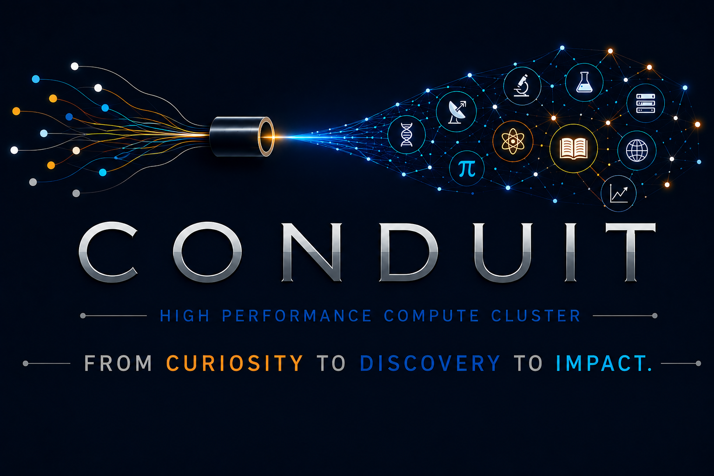

## Does my research need more compute power?

Research often outgrows your personal computer. It may be a simulation that would tie up your laptop for a week, a model that needs a larger GPU than your workstation can provide, or the need to run a thousand analyses you'd rather run all at once, than one at a time. That's where we come in.
 
At F&M, faculty and students use our resources for work in artificial intelligence, chemistry, astrophysics, computational neuroscience, computer science, and more. You don't need to be an expert in Linux, programming, or computing to start. Many people come to us with a basic idea for a project, or with a script that works on their own machine. They ask questions like: How can I make it scale better, run faster, handle larger data sets, or use memory more efficiently? That's a great place to start!

## Conduit, F&M's High Performance Computing (HPC) cluster

Just as Benjamin Franklin used a simple kite string to connect his idea to groundbreaking science, Conduit connects the ideas of our faculty and students to research that makes an impact. Bring the question; Conduit provides the power to pursue it.

| | |
|---|---|
| **CPU nodes** | 40 nodes with Intel Xeon Gold 6230 processors, 1,600 cores in total |
| **Memory** | 192 GB on 36 nodes, and 512 GB on 4 high-memory nodes |
| **GPU nodes** | 4 nodes, each with four NVIDIA GPUs of one type: V100 (32 GB), A100 (40 GB), L40S (48 GB), or H100 NVL (94 GB) |
| **Scratch storage** | 300 TB |
| **Network** | 100 Gb/s InfiniBand |
| **Scheduler** | Slurm |

After you reach out about your project, you can access Conduit right in your web browser through [Open OnDemand](https://fandm-college.github.io/ood/). Launch interactive apps, submit jobs, and manage your files with no command line required, or open a terminal when you want one.

## Getting started

1. **Tell us about your project.** [Open a ticket](https://request.fandm.edu) and search for Research Computing. A few sentences about what you're trying to do is plenty to start, and we'll reach out to you to talk more about your project and what resource fits best.
2. **We'll set you up.** We'll create your account and talk through what your work needs: software, storage, GPUs, or help moving data.
3. **Run your first job.** We're happy to sit down with you for it. After that, you'll have us to call on whenever you get stuck.

## Need something different?

Not every project fits the cluster. If you need access to a GPU, a system for a long-running service, more memory, or software that doesn't play well with a shared system, one of our [virtual research systems](../../documentation/virtual-systems/) may suit you better.

And if your work needs more than F&M's campus solutions can provide, we can help you get time on national resources like [ACCESS](https://access-ci.org/) and the [OSPool](https://osg-htc.org/services/ospool/).
